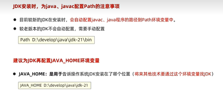
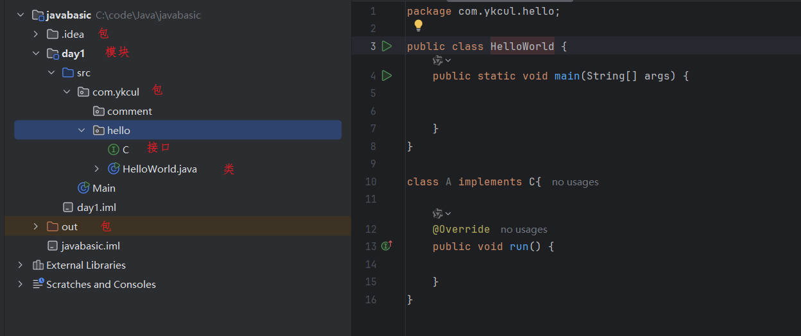

# Java基础学习笔记
部分参考资料：

[黑马程序员Java+AI智能辅助编程全套视频教程](https://www.bilibili.com/video/BV1gb42177hm/?spm_id_from=333.337.search-card.all.click&vd_source=5a9892c5685e5b7e1d5cbd33baa8869e)

## Java基础环境配置
java三大平台：javaSE（标准版）、javaEE（企业版）、javaME（小型版）

jdk：java开发者工具包（lts：长期支持版）

jdk文件夹中的bin文件夹里面java.exe为执行工具，javac.exe为编译工具

jdk包含
* jvm：java虚拟机，真正运行java程序的地方
* 核心类库：java自己写好的程序，给程序员自己的程序调用的
* jre：java的运行环境

基础开发步骤：1.编写代码（java后缀的源代码文件） 2.编译代码（命令：javac + 程序名.java） 3.运行代码（命令：java + 程序名）

注意：1.文件名称必须与代码中的类名称一致 2.建议代码文件名全英文，首字母大写，满足驼峰模式

**java工程结构**

1.project、module、package、class的关系

* 项目是一个完整的软件解决方案，它包含了实现某个特定功能或目标所需的所有代码、配置文件、资源等。就好比一个在线书店，它有用户管理、书籍管理、订单管理等多个功能，整个在线书店系统就是一个项目
* 模块是项目中相对独立的部分，它具有特定的功能，可将项目按功能或业务逻辑划分成多个模块，方便开发和维护。在在线书店项目中，可以把它划分成用户模块、书籍模块、订单模块。用户模块专门处理用户注册、登录、信息修改等操作；书籍模块负责书籍的添加、删除、查询等；订单模块处理订单的创建、支付、取消等
* 包是用来组织类的一种方式，类似于文件夹，可将相关的类放在同一个包中，避免类名冲突，也方便管理和查找。在用户模块中，可以创建以下几个包：
  * com.example.bookstore.user.dao：存放与用户数据访问相关的类，像与数据库交互的类
  * com.example.bookstore.user.service：存放用户业务逻辑的类，例如用户注册、登录的逻辑
  * com.example.bookstore.user.controller：存放处理用户请求的类，比如接收用户登录请求并调用相应的服务
* 类是 Java 程序的基本组成单元，它封装了数据和方法，代表了一个具体的实体或功能。在 com.example.bookstore.user.service 包中，可以有以下类：
  * UserService 类：负责处理用户的业务逻辑，像注册、登录等
  * UserServiceImpl 类：实现 UserService 接口，具体实现注册、登录的方法

2.IDEA常见的四个包的作用
* .idea 包：这个包是 IntelliJ IDEA 用来存储项目配置信息的隐藏文件夹。它包含项目的设置、插件信息、历史记录、版本控制信息等。此文件夹对于开发者来说是不可见的，IDEA 会自动管理这个文件夹中的内容。当工程被导入到其他电脑上的 IDEA 时，这个文件夹也会被导入，以确保项目的配置一致性
* out 包：这个包主要用来存放项目编译生成的文件，包括 class 文件、打包生成的 jar 文件等。当你编译项目时，IDEA 会把编译的结果放在这个目录下。此目录下的内容在构建过程中会被更新，但通常不需要开发者手动管理
* src 包：这是源代码目录，通常包含了项目中所有的 Java 源文件。在 src 目录下，你可以创建多个子包，用来组织不同的功能模块。例如：
  * bean：存放 JavaBean 类，通常被用来封装数据，如模型类
  * dao：存放数据访问对象（Data Access Objects），这些类负责与数据库进行交互，执行增删改查等操作
  * service：存放业务逻辑代码，处理业务流程
  * controller：存放控制器类，负责处理 HTTP 请求，将请求转发到其他模块处理
* web 包：这个包通常用于存放与 Web 有关的资源，如 JSP 文件、HTML 文件、CSS 样式表、JavaScript 文件等。在开发 Web 应用时，这个包会包含 Web 服务器上的静态资源

