# 黑马Java基础学习笔记
主要参考资料：

[黑马程序员Java+AI智能辅助编程全套视频教程](https://www.bilibili.com/video/BV1gb42177hm/?spm_id_from=333.337.search-card.all.click&vd_source=5a9892c5685e5b7e1d5cbd33baa8869e)

## Java基础环境配置
java三大平台：javaSE（标准版）、javaEE（企业版）、javaME（小型版）

jdk：java开发者工具包（lts：长期支持版）

jdk文件夹中的bin文件夹里面java.exe为执行工具，javac.exe为编译工具

jdk包含
* jvm：java虚拟机，真正运行java程序的地方
* 核心类库：java自己写好的程序，给程序员自己的程序调用的
* jre：java的运行环境


基础开发步骤：1.编写代码（java后缀的源代码文件） 2.编译代码（命令：javac + 程序名.java） 3.运行代码（命令：java + 程序名）

注意：1.文件名称必须与代码中的类名称一致 2.建议代码文件名全英文，首字母大写，满足驼峰模式

**java工程结构**

1.project、module、package、class的关系

* 项目是一个完整的软件解决方案，它包含了实现某个特定功能或目标所需的所有代码、配置文件、资源等。就好比一个在线书店，它有用户管理、书籍管理、订单管理等多个功能，整个在线书店系统就是一个项目
* 模块是项目中相对独立的部分，它具有特定的功能，可将项目按功能或业务逻辑划分成多个模块，方便开发和维护。在在线书店项目中，可以把它划分成用户模块、书籍模块、订单模块。用户模块专门处理用户注册、登录、信息修改等操作；书籍模块负责书籍的添加、删除、查询等；订单模块处理订单的创建、支付、取消等
* 包是用来组织类的一种方式，类似于文件夹，可将相关的类放在同一个包中，避免类名冲突，也方便管理和查找。在用户模块中，可以创建以下几个包：
  * com.example.bookstore.user.dao：存放与用户数据访问相关的类，像与数据库交互的类
  * com.example.bookstore.user.service：存放用户业务逻辑的类，例如用户注册、登录的逻辑
  * com.example.bookstore.user.controller：存放处理用户请求的类，比如接收用户登录请求并调用相应的服务
* 类是 Java 程序的基本组成单元，它封装了数据和方法，代表了一个具体的实体或功能。在 com.example.bookstore.user.service 包中，可以有以下类：
  * UserService 类：负责处理用户的业务逻辑，像注册、登录等
  * UserServiceImpl 类：实现 UserService 接口，具体实现注册、登录的方法

2.IDEA常见的四个包的作用
* .idea 包：这个包是 IntelliJ IDEA 用来存储项目配置信息的隐藏文件夹。它包含项目的设置、插件信息、历史记录、版本控制信息等。此文件夹对于开发者来说是不可见的，IDEA 会自动管理这个文件夹中的内容。当工程被导入到其他电脑上的 IDEA 时，这个文件夹也会被导入，以确保项目的配置一致性
* out 包：这个包主要用来存放项目编译生成的文件，包括 class 文件、打包生成的 jar 文件等。当你编译项目时，IDEA 会把编译的结果放在这个目录下。此目录下的内容在构建过程中会被更新，但通常不需要开发者手动管理
* src 包：这是源代码目录，通常包含了项目中所有的 Java 源文件。在 src 目录下，你可以创建多个子包，用来组织不同的功能模块。例如：
  * bean：存放 JavaBean 类，通常被用来封装数据，如模型类
  * dao：存放数据访问对象（Data Access Objects），这些类负责与数据库进行交互，执行增删改查等操作
  * service：存放业务逻辑代码，处理业务流程
  * controller：存放控制器类，负责处理 HTTP 请求，将请求转发到其他模块处理
* web 包：这个包通常用于存放与 Web 有关的资源，如 JSP 文件、HTML 文件、CSS 样式表、JavaScript 文件等。在开发 Web 应用时，这个包会包含 Web 服务器上的静态资源


## 基础知识
引用数据类型中类名、变量名建议采用驼峰命名模式，前者首字母大写，后者首字母小写

输入：导包`import java.util.Scanner`，创建对象`Scanner sc = new Scanner(System.in)`，输入：`int age = sc.nextInt()`，输入字符串用:`sc.next()`

导包配置：settings->Auto import->勾选：Add unambiguous imports on the fly和Optimize imports on the fly

+符号做运算符还是连接符？例如：`int a = 5; a + 'a' + "123"`结果为"102123"，也就是能算则算，算不了就连接

逻辑运算符有：`& | ! ^ && ||`

**数组初始化**
```java
String[] names = {"john", "jack"};
double[] scores = new double[8];
String[] names = {
    {"a", "b", "c"},
    {"d", "e", "f"}
};
int [][] nums = new int[6][6];
```

## 面向对象
this是一个变量，可以用在方法中，其值等于当前对象的地址，作用：解决变量名称冲突的问题
```java
public class Person {
    private String name;
    private int age;
    public Person(String name, int age) {
        // 这里的局部变量name和age与成员变量同名
        // 使用this.name和this.age来访问成员变量
        this.name = name; 
        this.age = age; 
    }
    public void introduce() {
        System.out.println("我叫" + name + "，今年" + age + "岁。");
        // 这里的name和age虽然没写this，但默认就是访问成员变量
    }
}
```
**封装**：如何隐藏(private有关变量和方法）、如何暴露（可以使用get、set方法进行合理暴露）。自动生成getter、setter？在IDEA中：右键-->generate-->getter and setter

实体类javabean：1.成员变量全部为私有、并提供public修饰的getter/setter方法 2.类中需要提供一个无参数构造器、有参数构造器可选，一般这种类只负责对数据的存储，对数据的操作，可以单独使用其它的类来进行处理

static修饰的变量（静态变量or类变量）在计算机中只有一份、会被类的全部对象共享，建议用类访问而不是实例访问
```java
// Counter.java
public class Counter {
    // 用static修饰count变量，使其成为静态变量，属于类，被所有对象共享
    public static int count = 0; 

    public Counter() {
        // 每次创建Counter对象，count就自增1
        count++; 
    }
}
// Main.java
public class Main {
    public static void main(String[] args) {
        Counter counter1 = new Counter();
        Counter counter2 = new Counter();
        System.out.println("对象创建个数: " + Counter.count); 
    }
}
```
静态方法：如果一个方法只是为了完成一项功能，而不需要直接访问对象的数据，则定义为静态方法，应用场景：工具类（***Util），可以提高代码复用性，工具类没有创建对象的需求，建议将其构造器进行私有。
注意事项：1.静态方法中可以直接访问静态成员，不可以直接访问实例成员 2.实例方法中既可以直接访问静态成员，也可以直接访问实例成员 3.实例方法中可以出现this关键字，静态方法中不可以出现this关键字
```java
// ArrayUtils.java
public class ArrayUtils {
    // 静态方法：判断数组中的元素是否都为偶数
    public static boolean allEven(int[] arr) {
        for (int num : arr) {
            if (num % 2 != 0) {
                return false;
            }
        }
        return true;
    }
}
// Main.java
public class Main {
    public static void main(String[] args) {
        int[] arr1 = {2, 4, 6, 8};
        int[] arr2 = {2, 3, 4, 6};

        // 直接使用类名调用静态方法
        boolean result1 = ArrayUtils.allEven(arr1);
        boolean result2 = ArrayUtils.allEven(arr2);

        System.out.println("arr1 中的元素是否都为偶数: " + result1);
        System.out.println("arr2 中的元素是否都为偶数: " + result2);
    }
}
```
**继承**

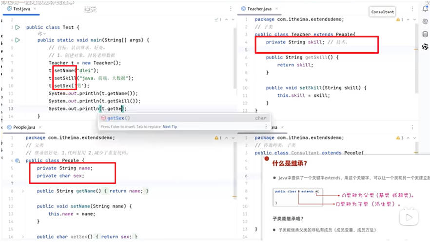
权限修饰符：

* private：只能在本类内部访问
* 缺省：可以在本类内部、同一个包中的其它类中访问
  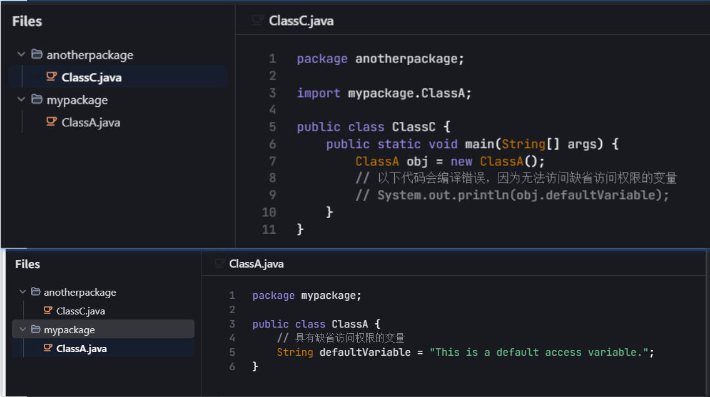
* protected：本类、同一个包中的类、子孙类中
* public：任意位置

super：可以强制访问父类变量/方法

方法重写：1.方法名称、形参列表必须和被重写方法相同 2.子类重写父类方法时，访问权限必须大于等于父类该方法的权限  3.私有方法、静态方法不能被重写  4.最好在重写的方法上加上重写校验标志：`@Override`  5.返回值类型相对于被重写的范围更小，或者类型相同。常见的场景有：子类重写Object类的toString方法，以适应对象内容，如下图所示
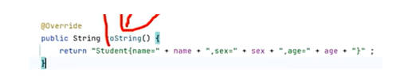

this(...)可以调用该类的其它构造器，如下图所示
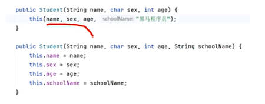

**多态**
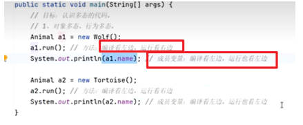

多态的好处：1.多态形势下，右边对象是解耦合的，更便于扩展、维护  2.定义方法时，直接使用父类的形参，可以接受一切子类对象，扩展性更强、更便利，如下图
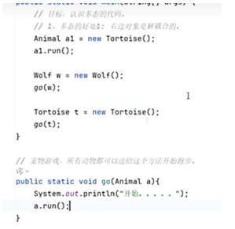

多态下不能调用子类的独有功能，一种思路是强制转换，具体如下图所示
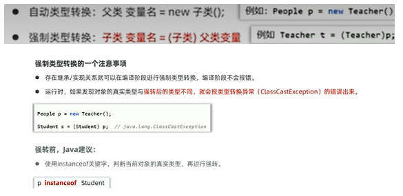

了解--lombok技术
## 高级面向对象
final：修饰类-->不能再被继承  修饰方法-->不能被重写  修饰变量-->有且能被赋值一次

final修饰基本类型的变量，变量存储的数据不能改变；final修饰引用类型的变量，变量存储的地址不能被改变

常量：使用static final修饰的成员变量；作用：常用于记录系统的配置信息，一般使用大写英文、单词间用下划线连接；代码可读性更好，在程序编译后，常量会被“宏替换”：出现常量的地方会被全部替换成其记住的字面量，使其性能与直接使用字面量性能相同

**单例设计模式**
作用：确保某一个类只能创建一个对象

饿汉式实现步骤：1.把类的构造器私有化  2.定义一个类变量记住类的一个对象  3.定义一个类方法，返回对象

懒汉式实现步骤：1.把类的构造器私有化  2.定义一个静态变量用于存储对象  3.提供一个静态方法，保证返回的是同一个对象
```java
//饿汉式单例
public class A {
    private static A a = new A();
    
    private A() {
        
    }
    public static A getObject() {
        return a;
    }
}
```
```java
//懒汉式单例
public class B {
    private static B b;
    private B() {
        
    }
    public staitc B getObject() {
        if (b == null) {
            b = new B();
        }
        return b;
    }
}
```
**枚举类**
特点：1.枚举类的第一行，只能写枚举类的对象名称，用逗号隔开  2.这些名称，本质是常来，且每个常量都记住了枚举类的一个对象，如下图的反编译案例
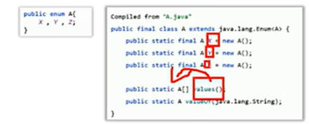

枚举类都是final类，不能被继承，枚举类都继承java.lang.enum类；枚举类的构造器都是私有的，因此，枚举类对外不可以创建对象；使用枚举类是一种多例设计模式，如果里面只写一个名称，那么就是一种很好的单例设计方法

使用案例
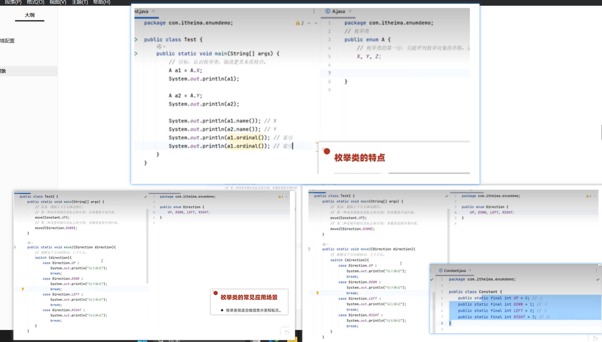

**抽象类**
```java
修饰符 abstract class 类名 {
    修饰符 abstract 返回值类型 方法名称(形参列表);
}
public abstract class A {
    public abstract void test();
}
```
特点：1.抽象类中不一定要有抽象方法，有抽象方法的类必须是抽象类  2.类有的成员：成员变量、方法、构造器、抽象类都可以有  3.抽象类最主要的特点：抽象类不能创建对象，仅作为一种特殊的父类，让子类继承并实现  4.一个类继承抽象类，必须重写完抽象类的全部抽象方法，否则这个类也必须定义成抽象类

抽象类的好处：为了更好地使用多态
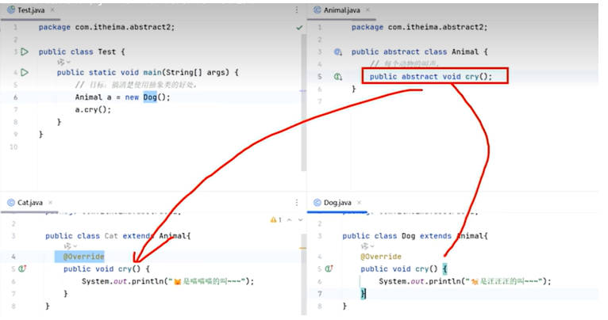

**模板方法设计模式**
提供一个方法作为完成某类功能的模板，模板方法封装了每个实现步骤，但运行子类提供特定步骤的实现

实现：1.定义一个抽象类  2.在里面定义两个方法，一个是模板方法：把共同的实现步骤放里面；另一个是抽象方法：不确定的实现步骤，交给具体的子类实现
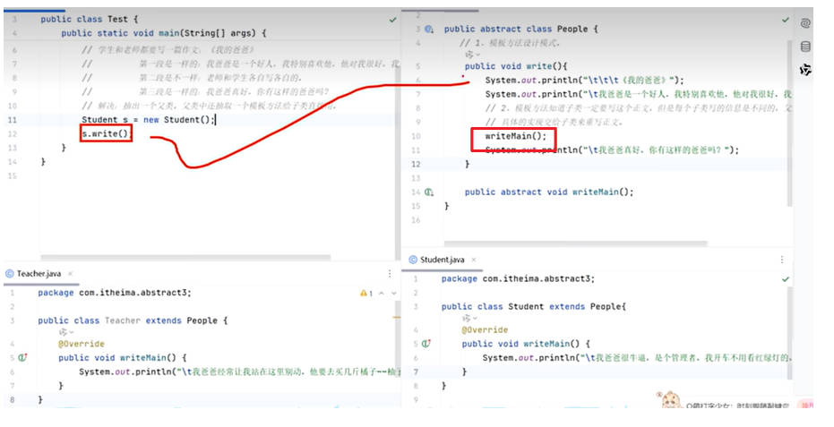

**接口**
jdk8及之前接口只有常量和抽象方法，接口中定义常量可以省略public static final，定义抽象方法可以省略public abstract不写，默认会加上去

实现类写好之后，可以把光标放在红线上面，使用alt+回车+回车全部重写相关全部重写相关类

接口的好处：弥补了类单继承的不足，一个类同时可以实现多个接口，使类的角色更多，功能更强大，同时让程序可以面向接口编程，程序要可以灵活方便地切换各种业务实现，更利于程序的解耦合
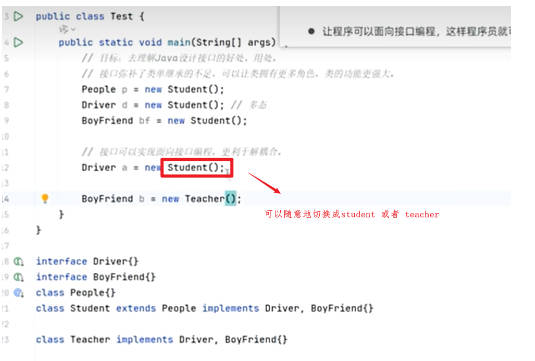

接口和抽象类对比：
* 相同点：
  * 都是抽象形式，都可以有抽象方法，都不能创建对象
  * 都是派生子类形式，抽象类是被子类继承使用，接口是被实现类实现
  * 一个类继承抽象类或者实现接口都必须重写完它们的抽象方法，否则自己成为抽象类或者报错
  * 都能支持多态、都能实现解耦合
* 不同点
  * 抽象类中可以定义类的全部普通成员，接口只能定义常量和抽象方法（jdk8之后新增三种方法）
  * 抽象类只能被类单继承，接口可以被类多实现
  * 一个类继承抽象类不能继承其它类，一个类实现了接口还可以继承其它类或者实现其它接口
  * 抽象类体现模板思想，更利于做父类，实现代码复用性（如：io流）
  * 接口更适合做功能的解耦合，解耦合性更强更灵活（如：集合）

**代码块**
静态代码块：static{}类加载时自动执行，只会执行一次，优先加载；作用：完成类的初始化，比如对静态变量的初始化赋值

实例代码块：{}每次创建对象时，执行实例代码块，并在构造器前执行

**内部类**
成员内部类：就是类中的一个普通成员：
```java
public class Outer {
    public class Inner {

    }
}
```
创建对象的格式：外部类名.内部类名 对象名 = new 外部类(...).new 内部类(...);如`Outer.Inner in = new Outer().new Inner()`

特点：1.成员内部类中可以直接访问外部类的实例成员、静态成员  2.成员内部类的实例方法中，可以直接拿到当前外部类对象，格式是`外部类名.this`，一个例子见下面代码
```java
// Outer.java
class Outer {
    private int outerValue = 10;
    
    class Inner {
        private int innerValue = 20;
        
        public void printValues() {
            // 获取外部类实例
            Outer outer = Outer.this;
            
            // 访问外部类的私有成员
            System.out.println("外部类的outerValue: " + outer.outerValue);
            System.out.println("内部类的innerValue: " + this.innerValue);
            
            // 直接通过外部类名.this访问外部成员
            System.out.println("直接访问外部类的outerValue: " + Outer.this.outerValue);
        }
    }
    
    public void createInner() {
        Inner inner = new Inner();
        inner.printValues();
    }
}
// InnerClassExample.java
public class InnerClassExample {
    public static void main(String[] args) {
        Outer outer = new Outer();
        outer.createInner();
    }
}
```
静态内部类
```java
public class Outer {
    public static class Inner {

    }
}
```
创建格式与成员内部类一样，静态内部类可以直接访问外部类的静态成员，不可以直接访问外部类的实例成员

局部内部类：略

匿名内部类：
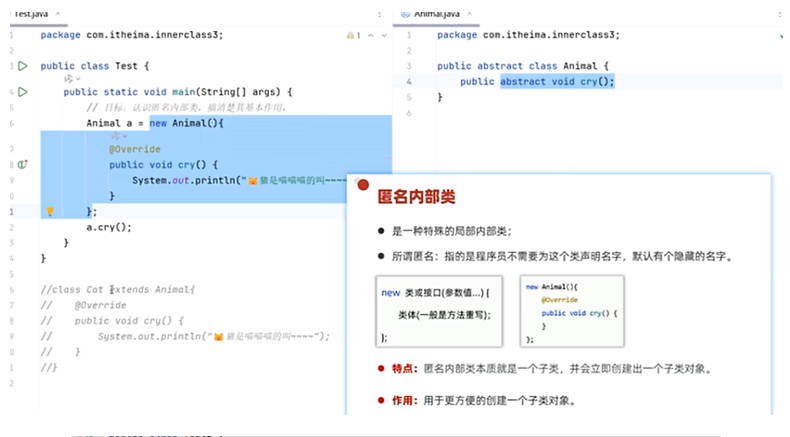

```java
//使用comparator接口的匿名内部类实现对数组进行排序
public class Test {
    public static void main(String[] args) {
        Student[] students = new Student[3];
        students[0] = new Student("name1", 16, 170.1);
        students[1] = new Student("name2", 18, 180.0);
        
```
