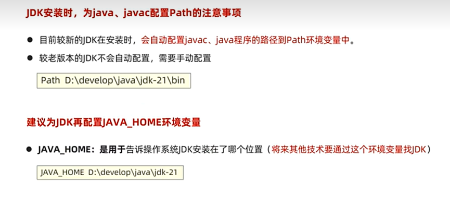
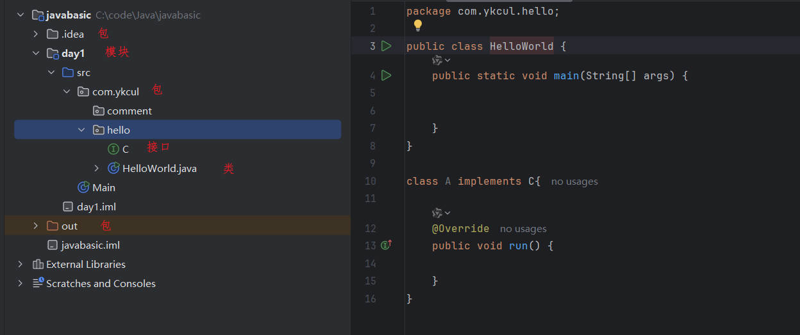

# 黑马Java基础学习笔记
主要参考资料：

[黑马程序员Java+AI智能辅助编程全套视频教程](https://www.bilibili.com/video/BV1gb42177hm/?spm_id_from=333.337.search-card.all.click&vd_source=5a9892c5685e5b7e1d5cbd33baa8869e)

## Java基础环境配置
java三大平台：javaSE（标准版）、javaEE（企业版）、javaME（小型版）

jdk：java开发者工具包（lts：长期支持版）

jdk文件夹中的bin文件夹里面java.exe为执行工具，javac.exe为编译工具

jdk包含
* jvm：java虚拟机，真正运行java程序的地方
* 核心类库：java自己写好的程序，给程序员自己的程序调用的
* jre：java的运行环境



基础开发步骤：1.编写代码（java后缀的源代码文件） 2.编译代码（命令：javac + 程序名.java） 3.运行代码（命令：java + 程序名）

注意：1.文件名称必须与代码中的类名称一致 2.建议代码文件名全英文，首字母大写，满足驼峰模式

**java工程结构**

1.project、module、package、class的关系

* 项目是一个完整的软件解决方案，它包含了实现某个特定功能或目标所需的所有代码、配置文件、资源等。就好比一个在线书店，它有用户管理、书籍管理、订单管理等多个功能，整个在线书店系统就是一个项目
* 模块是项目中相对独立的部分，它具有特定的功能，可将项目按功能或业务逻辑划分成多个模块，方便开发和维护。在在线书店项目中，可以把它划分成用户模块、书籍模块、订单模块。用户模块专门处理用户注册、登录、信息修改等操作；书籍模块负责书籍的添加、删除、查询等；订单模块处理订单的创建、支付、取消等
* 包是用来组织类的一种方式，类似于文件夹，可将相关的类放在同一个包中，避免类名冲突，也方便管理和查找。在用户模块中，可以创建以下几个包：
  * com.example.bookstore.user.dao：存放与用户数据访问相关的类，像与数据库交互的类
  * com.example.bookstore.user.service：存放用户业务逻辑的类，例如用户注册、登录的逻辑
  * com.example.bookstore.user.controller：存放处理用户请求的类，比如接收用户登录请求并调用相应的服务
* 类是 Java 程序的基本组成单元，它封装了数据和方法，代表了一个具体的实体或功能。在 com.example.bookstore.user.service 包中，可以有以下类：
  * UserService 类：负责处理用户的业务逻辑，像注册、登录等
  * UserServiceImpl 类：实现 UserService 接口，具体实现注册、登录的方法

2.IDEA常见的四个包的作用
* .idea 包：这个包是 IntelliJ IDEA 用来存储项目配置信息的隐藏文件夹。它包含项目的设置、插件信息、历史记录、版本控制信息等。此文件夹对于开发者来说是不可见的，IDEA 会自动管理这个文件夹中的内容。当工程被导入到其他电脑上的 IDEA 时，这个文件夹也会被导入，以确保项目的配置一致性
* out 包：这个包主要用来存放项目编译生成的文件，包括 class 文件、打包生成的 jar 文件等。当你编译项目时，IDEA 会把编译的结果放在这个目录下。此目录下的内容在构建过程中会被更新，但通常不需要开发者手动管理
* src 包：这是源代码目录，通常包含了项目中所有的 Java 源文件。在 src 目录下，你可以创建多个子包，用来组织不同的功能模块。例如：
  * bean：存放 JavaBean 类，通常被用来封装数据，如模型类
  * dao：存放数据访问对象（Data Access Objects），这些类负责与数据库进行交互，执行增删改查等操作
  * service：存放业务逻辑代码，处理业务流程
  * controller：存放控制器类，负责处理 HTTP 请求，将请求转发到其他模块处理
* web 包：这个包通常用于存放与 Web 有关的资源，如 JSP 文件、HTML 文件、CSS 样式表、JavaScript 文件等。在开发 Web 应用时，这个包会包含 Web 服务器上的静态资源


## 基础知识
引用数据类型中类名、变量名建议采用驼峰命名模式，前者首字母大写，后者首字母小写

输入：导包`import java.util.Scanner`，创建对象`Scanner sc = new Scanner(System.in)`，输入：`int age = sc.nextInt()`，输入字符串用:`sc.next()`

导包配置：settings->Auto import->勾选：Add unambiguous imports on the fly和Optimize imports on the fly

+符号做运算符还是连接符？例如：`int a = 5; a + 'a' + "123"`结果为"102123"，也就是能算则算，算不了就连接

逻辑运算符有：`& | ! ^ && ||`

**数组初始化**
```java
String[] names = {"john", "jack"};
double[] scores = new double[8];
String[] names = {
    {"a", "b", "c"},
    {"d", "e", "f"}
};
int [][] nums = new int[6][6];
```

## 面向对象
this是一个变量，可以用在方法中，其值等于当前对象的地址，作用：解决变量名称冲突的问题
```java
public class Person {
    private String name;
    private int age;
    public Person(String name, int age) {
        // 这里的局部变量name和age与成员变量同名
        // 使用this.name和this.age来访问成员变量
        this.name = name; 
        this.age = age; 
    }
    public void introduce() {
        System.out.println("我叫" + name + "，今年" + age + "岁。");
        // 这里的name和age虽然没写this，但默认就是访问成员变量
    }
}
```
**封装**：如何隐藏(private有关变量和方法）、如何暴露（可以使用get、set方法进行合理暴露）。自动生成getter、setter？在IDEA中：右键-->generate-->getter and setter

实体类javabean：1.成员变量全部为私有、并提供public修饰的getter/setter方法 2.类中需要提供一个无参数构造器、有参数构造器可选，一般这种类只负责对数据的存储，对数据的操作，可以单独使用其它的类来进行处理

static修饰的变量（静态变量or类变量）在计算机中只有一份、会被类的全部对象共享，建议用类访问而不是实例访问
```java
// Counter.java
public class Counter {
    // 用static修饰count变量，使其成为静态变量，属于类，被所有对象共享
    public static int count = 0; 

    public Counter() {
        // 每次创建Counter对象，count就自增1
        count++; 
    }
}
// Main.java
public class Main {
    public static void main(String[] args) {
        Counter counter1 = new Counter();
        Counter counter2 = new Counter();
        System.out.println("对象创建个数: " + Counter.count); 
    }
}
```
静态方法：如果一个方法只是为了完成一项功能，而不需要直接访问对象的数据，则定义为静态方法，应用场景：工具类（***Util），可以提高代码复用性，工具类没有创建对象的需求，建议将其构造器进行私有。
注意事项：1.静态方法中可以直接访问静态成员，不可以直接访问实例成员 2.实例方法中既可以直接访问静态成员，也可以直接访问实例成员 3.实例方法中可以出现this关键字，静态方法中不可以出现this关键字
```java
// ArrayUtils.java
public class ArrayUtils {
    // 静态方法：判断数组中的元素是否都为偶数
    public static boolean allEven(int[] arr) {
        for (int num : arr) {
            if (num % 2 != 0) {
                return false;
            }
        }
        return true;
    }
}
// Main.java
public class Main {
    public static void main(String[] args) {
        int[] arr1 = {2, 4, 6, 8};
        int[] arr2 = {2, 3, 4, 6};

        // 直接使用类名调用静态方法
        boolean result1 = ArrayUtils.allEven(arr1);
        boolean result2 = ArrayUtils.allEven(arr2);

        System.out.println("arr1 中的元素是否都为偶数: " + result1);
        System.out.println("arr2 中的元素是否都为偶数: " + result2);
    }
}
```
**继承**


权限修饰符：

* private：只能在本类内部访问
* 缺省：可以在本类内部、同一个包中的其它类中访问
  
* protected：本类、同一个包中的类、子孙类中
* public：任意位置

super：可以强制访问父类变量/方法

方法重写：1.方法名称、形参列表必须和被重写方法相同 2.子类重写父类方法时，访问
